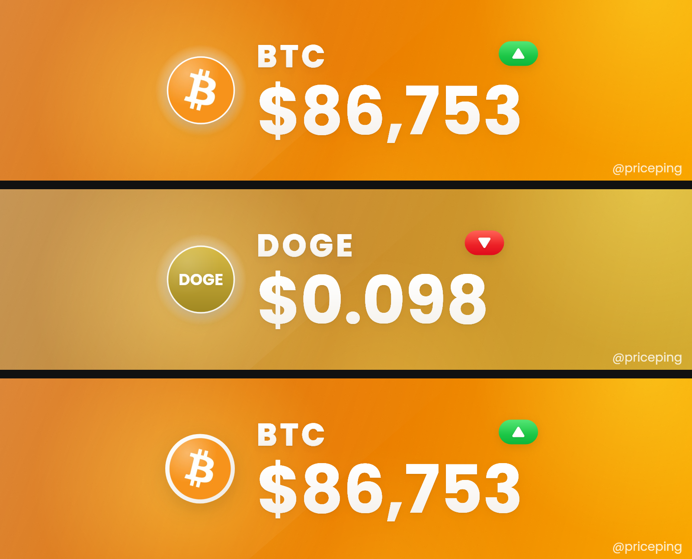
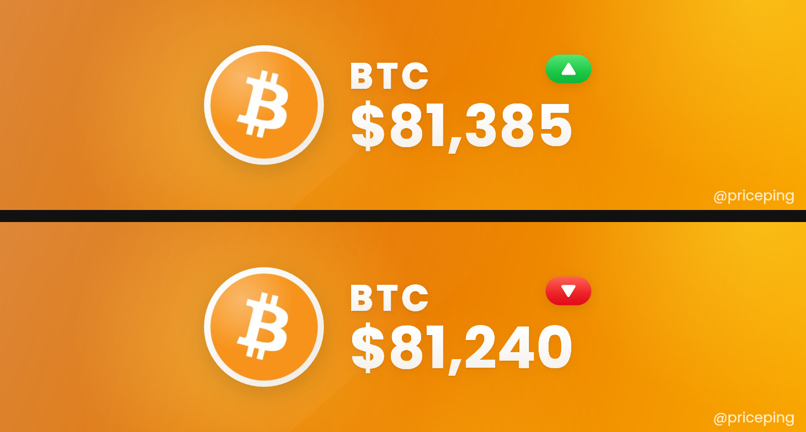
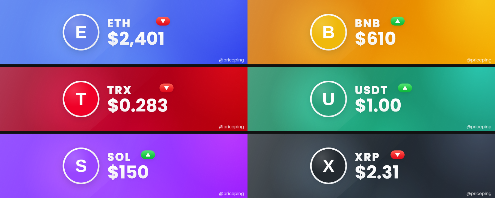

# priceping

Owner-only Telegram bot that posts milestone crypto price alerts to a
channel as branded image banners — one coin-colored card per coin, with
the ticker, direction arrow, and price.

## What it does

- Watches BTC, ETH, XRP, BNB, SOL, TRX, DOGE, ADA, LINK, TON, USDT, USDC
- Posts an image + caption to your channel whenever a coin crosses a
  milestone — either a dollar step (e.g. BTC every $500) or a percentage
  step (e.g. BTC every 0.5%), configurable per coin
- Four alert **modes** scale each coin's step up or down (see below)
- USDT/USDC use a depeg-band check instead (alerts if price strays too
  far from $1.00)
- You control everything via buttons in a private chat with the bot —
  steps, modes, mute (one coin, several, or all), live prices, posting
  current prices to the channel, price sources, and a test banner. Mutes can be indefinite or until a specific time (defaults to
  Africa/Nairobi, or any timezone you specify)
- Only you (the configured owner) can interact with the bot at all

## One-time setup

### 1. Create the bot

Talk to [@BotFather](https://t.me/BotFather) on Telegram, create a new
bot, and copy the token it gives you.

### 2. Find your Telegram user ID

Message [@userinfobot](https://t.me/userinfobot) — it replies with your
numeric ID. That's `OWNER_TELEGRAM_ID`.

### 3. Deploy to Railway

1. Push this project to a GitHub repo (or use Railway's CLI to deploy
   directly)
2. In Railway, create a new project from that repo
3. Add a **Postgres** plugin to the project
4. Add a **Redis** plugin to the project
5. Set the environment variables from `.env.example` in the Railway
   service settings (`BOT_TOKEN`, `OWNER_TELEGRAM_ID` — Railway wires up
   `DATABASE_URL` and `REDIS_URL` automatically once you add those
   plugins)
6. Railway will run `npm run build` (downloads coin logos
   into `/assets`) and then `npm start`. Any logo the build couldn't get is
   retried automatically when the bot starts (see "Coin logos" below)

### 4. Enable Redis keyspace notifications (for auto-unmute)

Scheduled mutes rely on Redis firing an event the instant their timer
expires, so the bot can lift the mute immediately rather than waiting for
the next price check. The bot tries to configure this itself on boot, but
some managed Redis plans block `CONFIG SET` from clients. If scheduled
mutes don't seem to auto-lift, connect to your Railway Redis instance's
CLI and run:

```
CONFIG SET notify-keyspace-events Ex
```

### 5. Connect the bot to your channel

1. Add the bot to your Telegram channel as an **admin** (it needs "Post
   Messages" permission)
2. Open a private chat with the bot and send `/start`
3. Forward any message from the channel into that chat (or just send the
   channel's `@username`)
4. The bot confirms the connection to you privately, then posts a
   one-time "Connected." message in the channel itself so you can see it
   went through

That confirmation post only happens the first time you connect (or if you
later reconnect to a different channel) — it never reposts on ordinary
redeploys or restarts.

## Using the bot

Once connected, everything is button-driven in your private chat with the
bot (only `/start` is a slash command). The menu:

```
[💰 Prices]   [📣 Post prices]
[📊 Status]   [⚙️ Settings]
[🔕 Mute]     [🧪 Test banner]
```

- **💰 Prices** — live price, step and mode for every coin, with a refresh
  button (and a shortcut to Post prices). It's a normal formatted message
  (not a code block), so Refresh edits it in place instead of failing to
  update
- **📣 Post prices** — post the *current* price of one coin, or of all coins,
  to the channel. You confirm first. Each banner uses the live price, and the
  chip shows the 24h direction (green up / red down); the caption adds the 24h
  change, e.g. `▲ BTC $81,385 · 24h +1.23% @priceping`. If the 24h change isn't
  available the banner simply has no chip
- **📊 Status** — every coin's step and mute state at a glance, e.g.
  `BTC — 0.5% 🔔`, `ETH — 0.75% 🔔`, `SOL — 0.5% 💨 🔔` (a coin that isn't
  on Steady also shows its mode icon)
- **⚙️ Settings** — per coin: edit the base step, switch between `$` steps
  and `%` steps, and choose a mode. "Modes · all coins" and "% / $ · all
  coins" change every coin at once. Also **🌐 Data source** and
  **🖼️ Logo style** (see below)
- **🔕 Mute** — mute or unmute one coin, **all** coins, or **several**
  (tick the ones you want). Durations: until you unmute, or until a time
  ("in 3 hours", "18:30", "9pm", or add a zone like "9pm EST")
- **🧪 Test banner** — pick a coin, then Rise, Fall, or a custom price. The
  preview is sent only to you, never to the channel

### Steps and modes

Each coin has a **base step (x)**, either in dollars (`$500` for BTC) or in
percent (`0.5%` for BTC). A **mode** multiplies it:

| Mode | Multiplier | BTC at $500 / 0.5% |
|---|---|---|
| 🚀 Hyper | ¼x | $125 / 0.125% |
| 💨 Fast | ½x | $250 / 0.25% |
| 🎯 Steady (default) | x | $500 / 0.5% |
| 😌 Calm | 2x | $1,000 / 1% |

- **$ steps**: alerts when the price crosses a round-number level; the
  banner shows that level
- **% steps**: alerts each time the price has moved that % from the last
  alert (up or down); the banner shows the actual price
- Default % steps: BTC 0.5%, ETH 0.75%, XRP 1%, BNB 0.75%, SOL 1%, the rest
  1% (USDT/USDC 0.5%). Existing coins stay on `$` steps until you switch
- Switching between $ and % restarts a coin from its current price, so it
  never fires an instant alert
- For USDT/USDC the step is the depeg band (± dollars, or ± percent)

### Data source (where prices come from)

Prices are fetched every 30 seconds. **Settings > 🌐 Data source** lets you
choose:

| Option | Behavior |
|---|---|
| 🤖 Auto (default) | CoinGecko first, Binance as backup |
| 🦎 CoinGecko only | never uses Binance |
| 🟨 Binance first | Binance leads, CoinGecko as backup (and for stablecoins) |

- The backup is automatic in Auto and Binance-first modes. Your choice is saved
- **USDT and USDC always use CoinGecko**: Binance has no dollar price for USDT,
  and its USDC price is measured in USDT, which could cause false depeg alerts
- Binance is tried on two hosts (`api.binance.com`, then
  `data-api.binance.vision`) because the first is blocked from some server
  regions
- **🔍 Test sources** checks each provider right now and shows ✅ / ❌, the
  response time and how many coins came back — the way to confirm the backup
  works from your server. If Binance's main address is blocked but its
  data address works, both attempts are listed so you can see why
- You get a private message when the main source starts failing (after 2 bad
  readings in a row) and when it recovers (after 3 good ones), and a 🚨
  message if every source is failing. Messages are limited to one per hour
  per kind

### Logo style

**Settings > 🖼️ Logo style** switches how the coin logo is framed on banners:
✨ **Clean** (default: no ring, a subtle light border and soft shadow, which
suits logos that already have their own circular design) or ⚪ **White ring**
(the earlier look). Use 🧪 Test banner to compare them.

### Price format

One rule for banners, captions and the Prices screen (dynamic precision):

| Price | Shown as |
|---|---|
| $10,000 and up | no decimals — `$86,019` |
| $1 to $10,000 | 2 decimals — `$4,021.45` |
| $0.01 to $1 | 3 decimals — `$0.096` |
| below $0.01 | 4 significant digits — `$0.00001234` |
| USDT / USDC | 3 decimals — `$0.994` (so a depeg is visible) |

### Coin logos

Logos are downloaded in one CoinGecko request (with retries and fallback
icon sources) at build time, and any that are still missing are fetched again
when the bot starts and every 30 minutes after. You get a private message if
some still can't be downloaded. Meanwhile a banner shows a coin-colored
badge with the ticker instead of the logo, so it never looks empty. Setting
the optional `COINGECKO_API_KEY` (a free demo key) raises CoinGecko's rate
limit.

### Tests

```
npm test
```

Covers the step/mode logic (dollar, percent, stablecoin), input parsing,
price formatting and captions, the logo downloader (rate limits, retries,
fallbacks), and the price sources (selection, Binance fallback, health alerts).

## Previews

**Current banners (1.2.0)** — top: Bitcoin (clean logo style); middle: DOGE
with a fall chip (it shows the coin-colored ticker badge used when a logo
file hasn't downloaded; with the logo present, the real logo is shown); bottom:
Bitcoin in the optional white-ring style. Everything is derived from each
coin's own brand color, so it applies to every coin automatically.



**Earlier layout (1.0.10)** — much larger logo, smaller price. Top: rise, bottom:
fall.



**Other coins (1.0.10)** — same engine (letter circles stand in for real
logos).



**Earlier still** — the version with the chip inline right after the ticker.


## Notes on the image banners

- Each coin's banner (1600x418) has a web-style glowing gradient built
  from that coin's brand color: a base that stays true to the brand hue,
  soft luminous light orbs, and a glass-like diagonal sheen — deliberately
  not the flat brand color, so the logo stands out
- Layout: a small coin logo on the left, vertically centered; to its right
  the ticker (bold, letter-spaced), a clear gap, then a big price, both
  left-aligned (the price shrinks automatically only if it would be too
  wide, e.g. $123,456). A direction chip sits up and to the right of the ticker,
  overhanging the price's right edge slightly. The chip is a small vivid
  green (rise) or red (fall) pill with a white arrow inside — the arrow is
  always white. For coins whose brand color is close to the chip's (TRON
  red, USDT green) the background is kept darker so the chip never
  disappears into it
- Text is white with a subtle pearl gradient and a soft brand-tinted
  shadow — no outlines
- The coin logo sits in a pearl-white circular margin with a soft drop
  shadow; nothing darkens the logo itself
- Coin logos are stored locally and the Poppins font is bundled in
  `assets/fonts` — posting a banner never waits on an external image or font
  host
- If a coin's logo file is missing, that banner uses a coin-colored ticker
  badge instead of the logo rather than breaking the post
